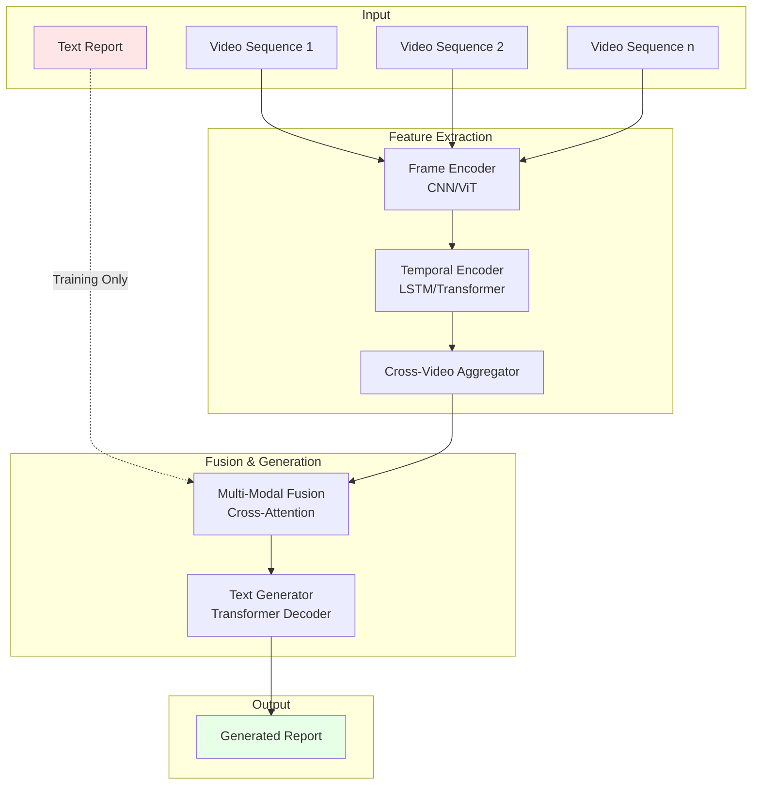
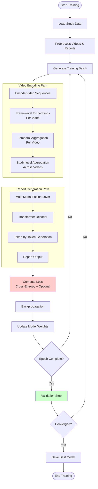
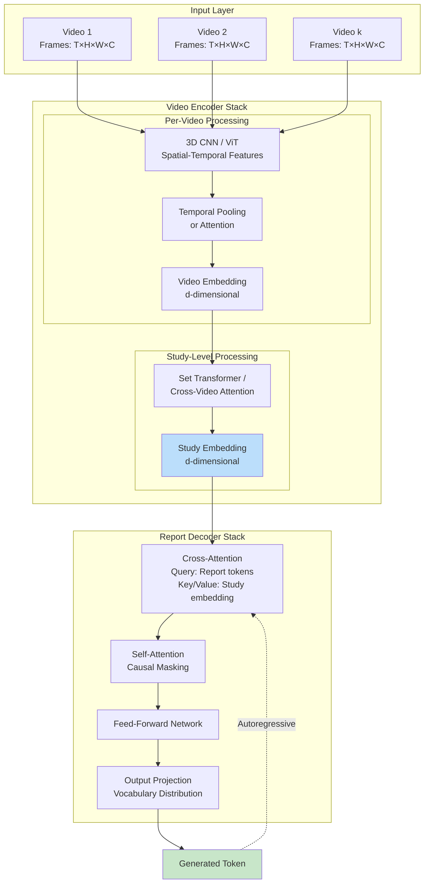
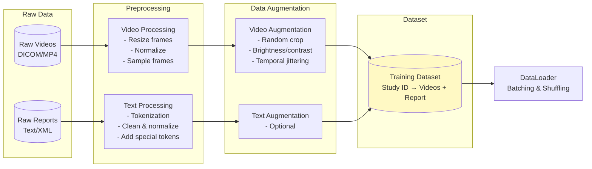
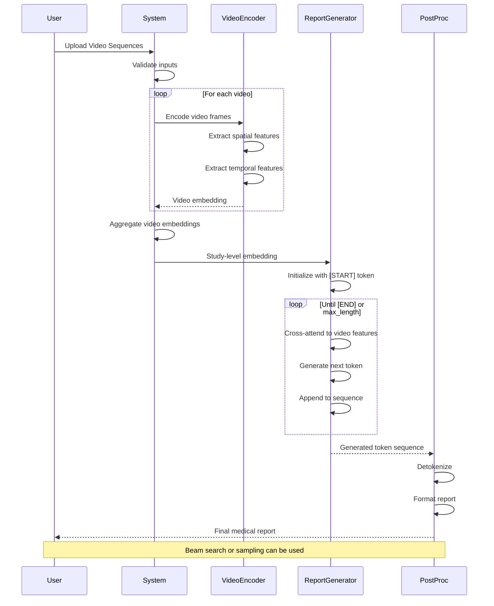
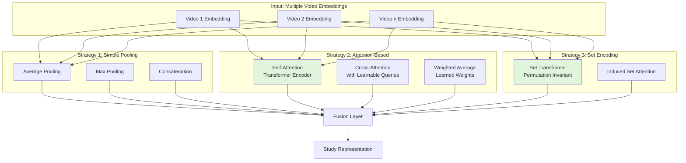
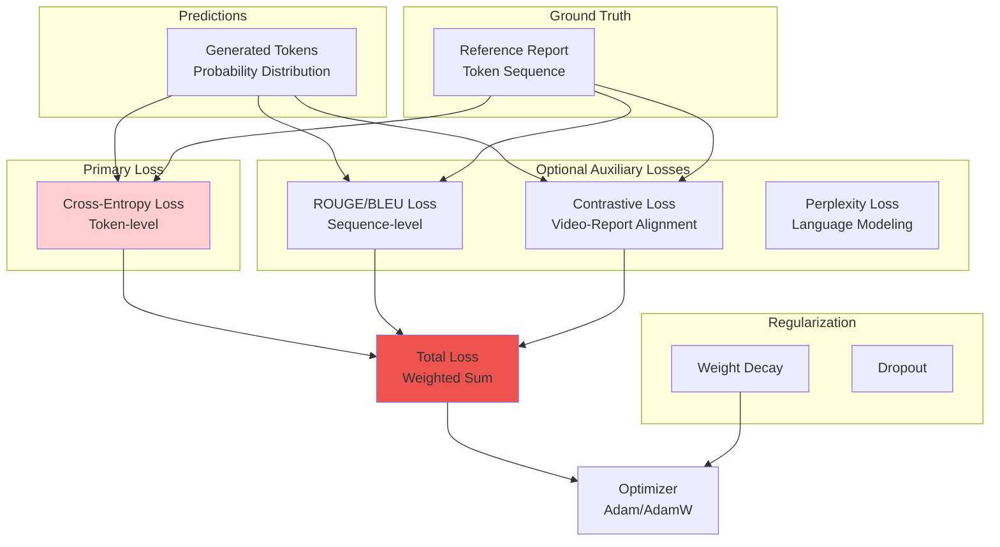
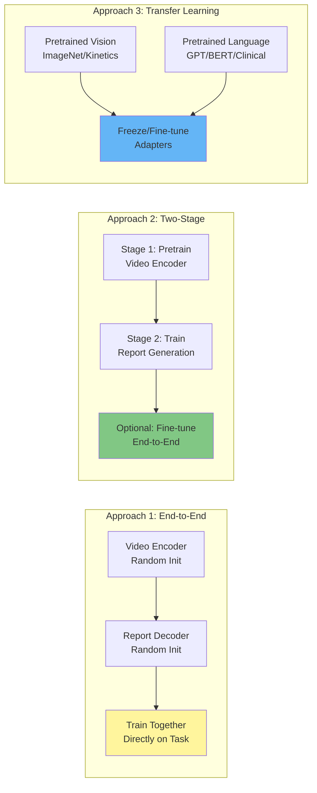
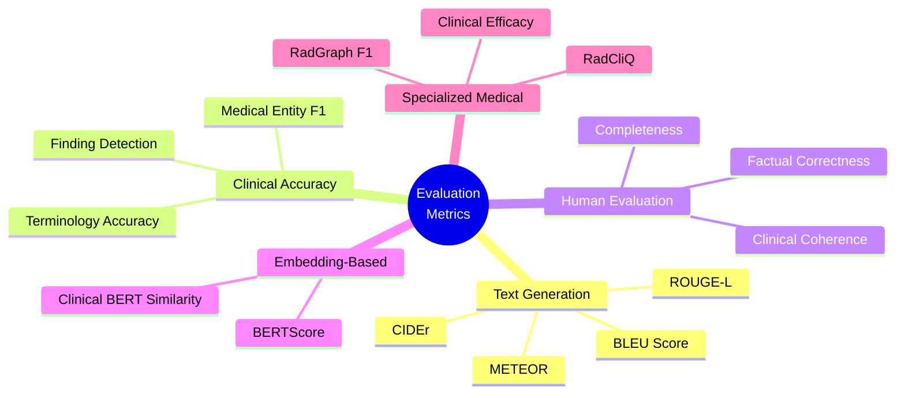
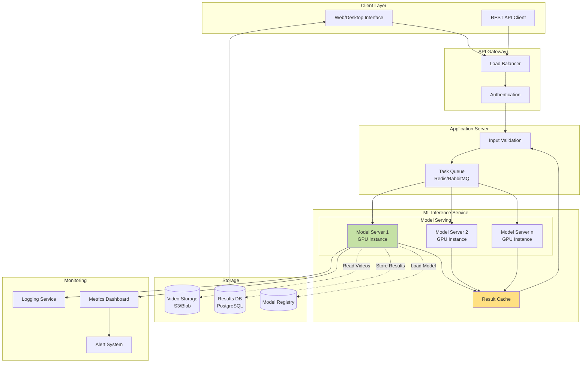

# Video-to-Report Generation System Design Diagrams

**Research-Grounded Design**: Each diagram below is inspired by and grounded in published research papers in medical imaging, video understanding, and multimodal AI.

---

## 1. High-Level System Architecture

**Inspired by**: 
- Chen et al. (2020) - "Generating Radiology Reports via Memory-driven Transformer" (R2Gen, EMNLP 2020)
- Nature Digital Medicine (2025) - "Multimodal generative AI for interpreting 3D medical images and videos"

**Key insight**: Medical report generation follows an encoder-decoder paradigm where video encoders extract spatial-temporal features and language decoders generate coherent clinical text.

## 2. Detailed Training Pipeline

**Inspired by**: 
- Pang et al. (2023) - "A survey on automatic generation of medical imaging reports based on deep learning" (PMC)
- arXiv (2026) - "arXiv:2602.17112" (https://arxiv.org/abs/2602.17112)

**Key insight**: Training medical image captioning models requires careful data preprocessing, multi-stage encoding (frame→temporal→study), and iterative validation with both NLG and clinical efficacy metrics.

## 3. Model Architecture (Encoder-Decoder)

**Inspired by**: 
- Chen et al. (2020) - "R2Gen: Memory-driven Transformer for Radiology Report Generation" (EMNLP 2020)
- Xu et al. (2015) - "Show, Attend and Tell: Neural Image Caption Generation with Visual Attention" (ICML 2015)
- Bertasius et al. (2021) - "Is Space-Time Attention All You Need for Video Understanding?" (TimeSformer, ICML 2021)

**Key insight**: Combining CNN/ViT for spatial features with temporal transformers, followed by cross-attention between visual and textual modalities enables high-quality report generation. R2Gen's memory-driven approach and TimeSformer's divided space-time attention are particularly effective.

## 4. Data Processing Pipeline

**Inspired by**: 
- Nature Digital Medicine (2025) - "Multimodal generative AI for interpreting 3D medical images and videos"
- Medical Image Captioning surveys showing preprocessing requirements for DICOM windowing and normalization

**Key insight**: Medical videos require specialized preprocessing (DICOM windowing, proper normalization, frame sampling) different from natural videos. Data augmentation must preserve clinical validity.

## 5. Inference Pipeline

**Inspired by**: 
- Standard encoder-decoder inference patterns from NLP/Vision literature
- Chen et al. (2020) R2Gen inference methodology
- Autoregressive generation with beam search from transformer literature

**Key insight**: Inference follows autoregressive token generation with cross-attention to video embeddings at each step. Study-level aggregation of multiple videos happens before report generation begins.

## 6. Multi-Video Aggregation Strategies

**Inspired by**: 
- Lee et al. (2019) - "Set Transformer: A Framework for Attention-based Permutation-Invariant Neural Networks" (ICML 2019)
- Attention mechanisms from Vaswani et al. (2017) - "Attention is All You Need" (NeurIPS 2017)
- Various pooling strategies from deep learning literature

**Key insight**: Multiple videos from one study require permutation-invariant aggregation. Set Transformers and attention-based pooling preserve information better than simple averaging, especially when videos have different clinical significance.

## 7. Loss Function Architecture

**Inspired by**: 
- Chen et al. (2020) R2Gen - Combined NLG and clinical efficacy losses
- Radford et al. (2021) CLIP - "Learning Transferable Visual Models from Natural Language Supervision" (contrastive alignment)
- Standard cross-entropy for language modeling

**Key insight**: Medical report generation benefits from multi-task learning: primary cross-entropy for token prediction, plus auxiliary losses for video-text alignment (contrastive) and clinical accuracy (domain-specific metrics).

## 8. Training Strategy Comparison

**Inspired by**: 
- Transfer learning literature (ImageNet → medical imaging)
- Google Research (2026) - MedGemma 1.5: demonstrating effectiveness of pretrained multimodal models for medical imaging
- Two-stage training from R2Gen and similar medical report generation papers

**Key insight**: Transfer learning from pretrained vision (ImageNet, Kinetics) and language models (BERT, GPT, Clinical-BERT) significantly outperforms training from scratch. Two-stage training (pretrain encoder, then train generator) offers good balance between quality and compute.

## 9. Evaluation Metrics Framework

**Inspired by**: 
- Chen et al. (2020) R2Gen - Natural Language Generation (NLG) + Clinical Efficacy (CE) metrics
- Pang et al. (2023) survey - Comprehensive evaluation framework for medical report generation
- Jing et al. (2019) - "On the Automatic Generation of Medical Imaging Reports" (clinical accuracy metrics)

**Key insight**: Medical report generation requires dual evaluation: (1) linguistic quality (BLEU, ROUGE, METEOR, CIDEr) and (2) clinical accuracy (medical entity F1, RadGraph, clinical correctness). Human evaluation remains gold standard.

## 10. Deployment Architecture

**Inspired by**: 
- Standard ML system deployment patterns (MLOps best practices)
- Production medical AI systems requiring high availability and auditability
- Microservices architecture from cloud computing literature

**Key insight**: Production medical AI requires: GPU-accelerated model serving, load balancing for multiple requests, caching for efficiency, comprehensive monitoring and logging for clinical validation, and version control for models and data.

---

## Key Research Papers Referenced

### Core Medical Report Generation:
1. **Chen, Z., Song, Y., Chang, T. H., & Wan, X. (2020)**. "Generating Radiology Reports via Memory-driven Transformer." *EMNLP 2020*. https://arxiv.org/abs/2010.16056
   - Introduces R2Gen with relational memory and memory-driven conditional layer normalization

2. **Pang, T., Li, P., & Zhao, L. (2023)**. "A survey on automatic generation of medical imaging reports based on deep learning." *Biomedical Engineering Online*. PMC10195007

3. **arXiv (2026)**. "arXiv:2602.17112". https://arxiv.org/abs/2602.17112

### Vision-Language Foundation Models:
4. **Xu, K., Ba, J., Kiros, R., Cho, K., Courville, A., Salakhutdinov, R., Zemel, R., & Bengio, Y. (2015)**. "Show, Attend and Tell: Neural Image Caption Generation with Visual Attention." *ICML 2015*. https://arxiv.org/abs/1502.03044
   - Pioneering attention mechanism for image captioning

5. **Radford, A., Kim, J. W., Hallacy, C., et al. (2021)**. "Learning Transferable Visual Models from Natural Language Supervision (CLIP)." *OpenAI*. https://arxiv.org/abs/2103.00020
   - Contrastive language-image pretraining that aligns vision and language

### Video Understanding:
6. **Bertasius, G., Wang, H., & Torresani, L. (2021)**. "Is Space-Time Attention All You Need for Video Understanding?" *ICML 2021*. https://arxiv.org/abs/2102.05095
   - TimeSformer: divided space-time attention for efficient video modeling

7. **Nature Digital Medicine (2025)**. "Multimodal generative AI for interpreting 3D medical images and videos." https://www.nature.com/articles/s41746-025-01649-4
   - Adapting video-text models for 3D medical imaging by treating volumes as video sequences

### Medical AI Products:
8. **Google Research (2026)**. "Next generation medical image interpretation with MedGemma 1.5 and medical speech to text with MedASR."
   - State-of-the-art medical multimodal models

### Architecture Components:
9. **Vaswani, A., et al. (2017)**. "Attention is All You Need." *NeurIPS 2017*. https://arxiv.org/abs/1706.03762
   - Foundational transformer architecture

10. **Lee, J., et al. (2019)**. "Set Transformer: A Framework for Attention-based Permutation-Invariant Neural Networks." *ICML 2019*.
    - Permutation-invariant aggregation for sets

### Clinical Datasets:
- **IU X-Ray Dataset**: 7,470 chest X-rays with 3,955 reports (Indiana University)
- **MIMIC-CXR**: Large-scale chest X-ray dataset with reports
- **Kinetics-400/600**: Video action recognition datasets used for pretraining

---

## Implementation Notes

For your specific task of video-to-report generation:

1. **Start with TimeSformer (Diagram 3)** for video encoding - it's specifically designed for medical imaging where you need to process multiple sequences
2. **Use R2Gen architecture (Diagram 3)** as your decoder with memory-driven attention
3. **Apply CLIP-style contrastive learning (Diagram 7)** to align video and text representations
4. **Implement Set Transformer (Diagram 6)** for aggregating multiple video sequences per study
5. **Follow the two-stage training strategy (Diagram 8)**: pretrain encoders, then train end-to-end

The combination of these research-backed approaches should give you a strong foundation for your medical video-to-report system.

